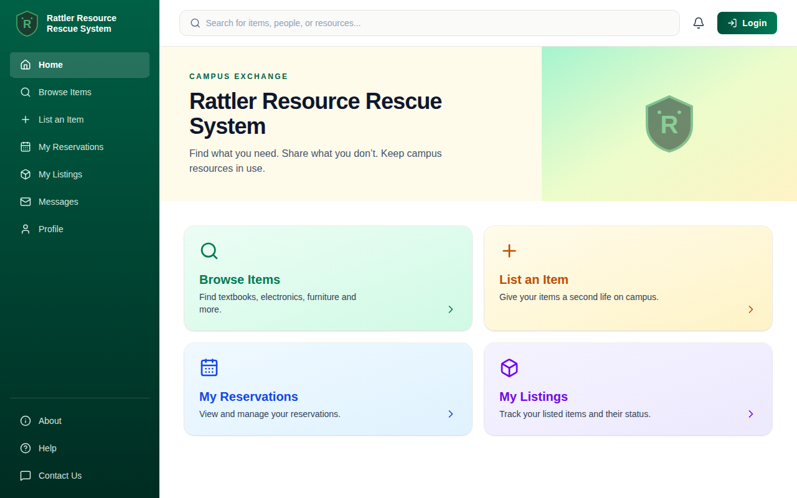

# Rattler Resource Rescue System – Frontend

Home screen (based on the Figma wireframe) built with **React + TypeScript + Tailwind CSS** (Vite).
It is a technical proof that the toolchain works. The navigation links are placeholders.



## Run it

Requires Node.js 20+.

```bash
cd frontend
npm install
npm run dev      # open http://localhost:5173/
```

Other scripts:

```bash
npm run build    # type-check and production build
npm test         # Vitest + React Testing Library
```
